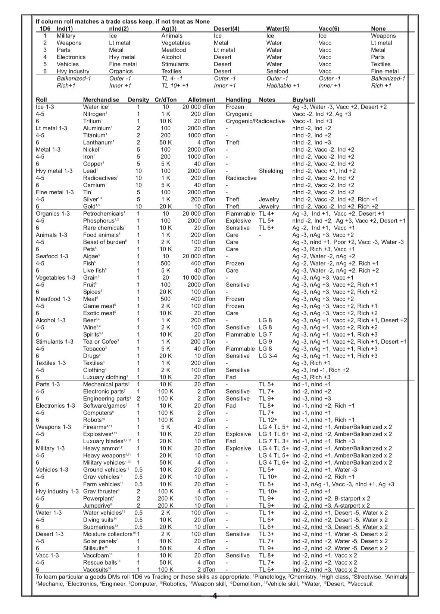

# Speculative Trade Generator

This web application is based on the speculative trade table published by **u/InterceptSpaceCombat** on the
[Reddit Traveller channel](https://www.reddit.com/r/traveller/comments/1rimleq/speculative_trade_table).
The author of this application does not claim any ownership of the table content and is merely providing a
convenient way to use the table.

## Source Table (Reference)

For convenience and attribution, the original table image used as the basis for the JSON transcription is included here:

Source: u/InterceptSpaceCombat on r/traveller  
https://www.reddit.com/r/traveller/comments/1rimleq/speculative_trade_table/

> Note: The included table image and the structured JSON transcription are treated as **data** in this repository and are covered by **CC BY-SA 4.0**.

## Dual License

This repository is dual-licensed:

- **Code** (HTML/CSS/JS): **MIT License** — see `LICENSE-MIT`
- **Data** (table content + JSON transcription + included source image): **CC BY-SA 4.0** — see `LICENSE-CC-BY-SA-4.0`

External references:
- MIT: https://opensource.org/license/mit/
- CC BY-SA 4.0: https://creativecommons.org/licenses/by-sa/4.0/

## Hosting

This project is designed to be hosted on **GitHub Pages**.
